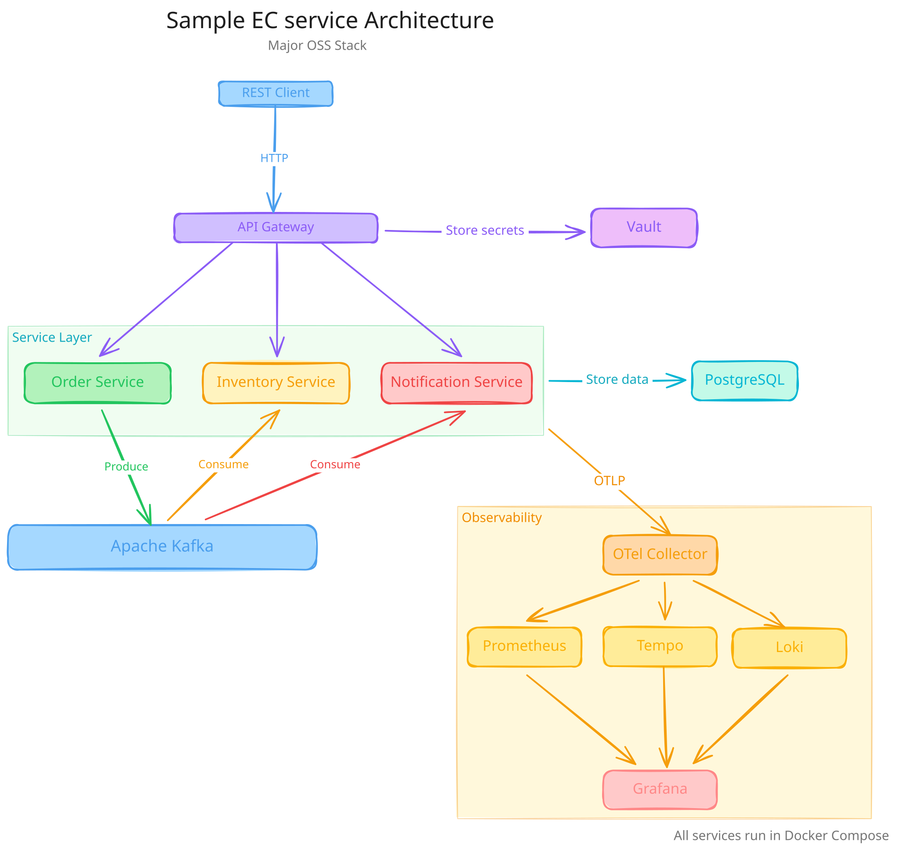

# Enterprise OSS Lab docs

## 概要

エンタープライズ向けの OSS を学ぶための organization です。
最終ゴールはエンタープライズ向け OSS を組み合わせたマイクロサービスのデモアプリケーションを構築することです。

## アーキテクチャ

最終ゴールのデモアプリケーションのアーキテクチャ図:

## 対象 OSS

- Kubernetes
- Apache Kafka
- Hashicorp Vault
- OpenTelemetry
- Grafana

### Kubernetes

### Apache Kafka

- [mnonaka-kafka-python-getting-started](https://github.com/enterprise-oss-lab/mnonaka-kafka-python-getting-started)
### Apache Kafka

### Hashicorp Vault

### OpenTelemetry

### Grafana
