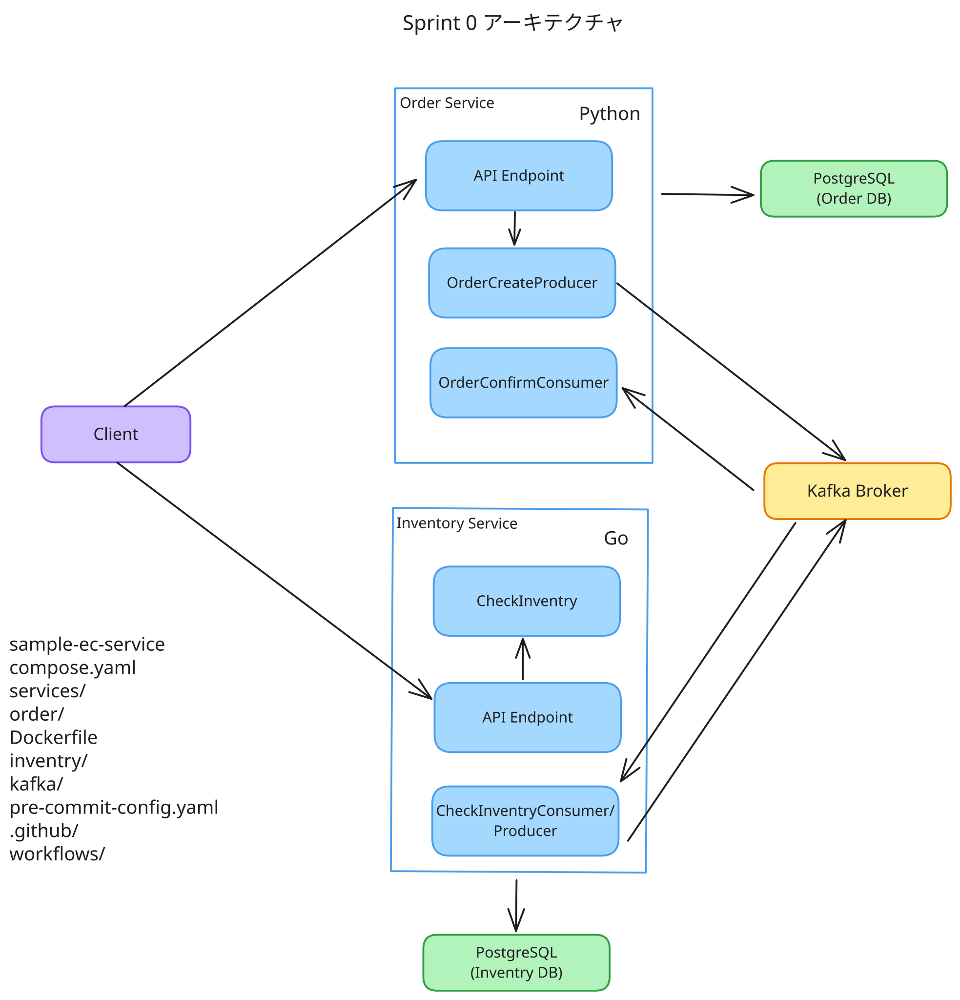
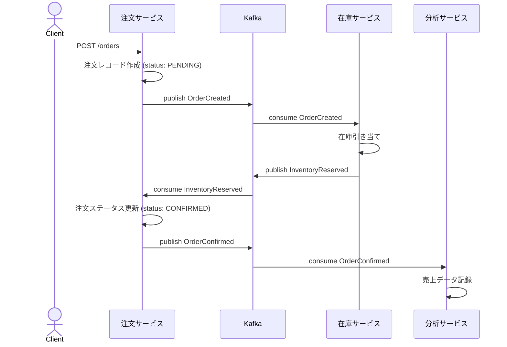
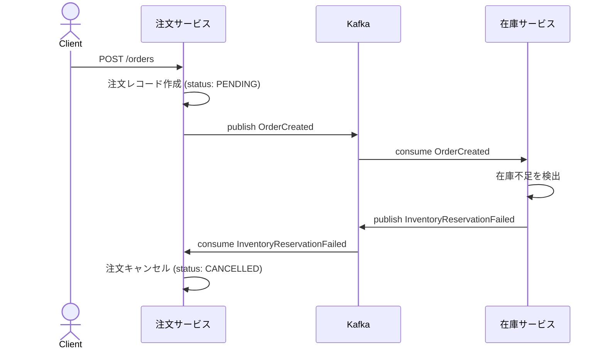
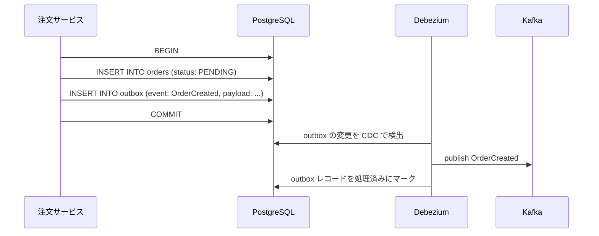

# 01. Sprint 0 Architecture

## 概要

注文サービス、在庫サービス、分析サービスのみを対象とする。
Saga パターン・ Outbox パターンを採用する。

## 使用するOSS

- Kafka
- PostgreSQL

## アーキテクチャ

## 補足

### Saga パターン

Kafka を使ったコレオグラフィ型 Saga。各サービスがイベントを発行・購読することで分散トランザクションを実現する。

#### 正常系（注文成功）

#### 異常系（在庫不足による補償トランザクション）

### Outbox パターン (今回は実装しない)

DB への書き込みと Kafka へのイベント発行を同一トランザクションで扱えないため、「DBに書いたがイベント発行に失敗する」二重書き込み問題が発生しうる。Outbox パターンはこれを解決する。

#### 仕組み

サービスはイベントを Kafka に直接発行せず、同一 DB トランザクション内の `outbox` テーブルに書き込む。別プロセス（Debezium など）が `outbox` テーブルの変更を CDC（Change Data Capture）で検出し、Kafka に転送する。

#### なぜこれで解決するか

| 障害タイミング | Outbox なし | Outbox あり |
|---|---|---|
| DB コミット前にクラッシュ | DB もイベントも残らない（整合） | 同左（整合） |
| DB コミット後・Kafka 発行前にクラッシュ | イベント欠損（不整合） | outbox に残るので再送される（整合） |
| Kafka 発行後・応答受信前にクラッシュ | 重複発行の可能性 | 同左（at-least-once、コンシューマ側でべき等処理が必要） |

#### コンシューマ側のべき等処理

Outbox パターンは at-least-once 保証のため、コンシューマは同じイベントを複数回受け取る可能性がある。各サービスはイベントの `event_id` を処理済みテーブルで管理し、重複を無視する。

## メモ

- 注文が失敗した場合は OrderDB 対象となるの注文レコードを Cancelled のステータスにする。
  - ユーザーは自分の注文の一覧とステータスを見れるようにしておく
  - 本来はメールでユーザーに通知するなどが必要だが、このスプリントでは実装しない

## 参考

https://tech-lab.sios.jp/archives/50773
https://zenn.dev/okamyuji/articles/microservices-saga-outbox-pattern
