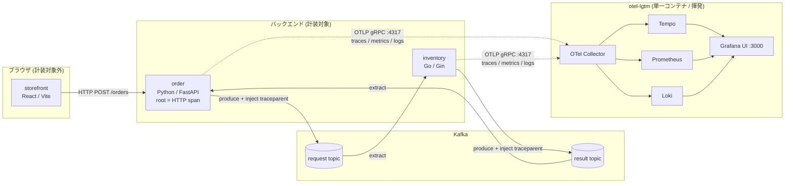
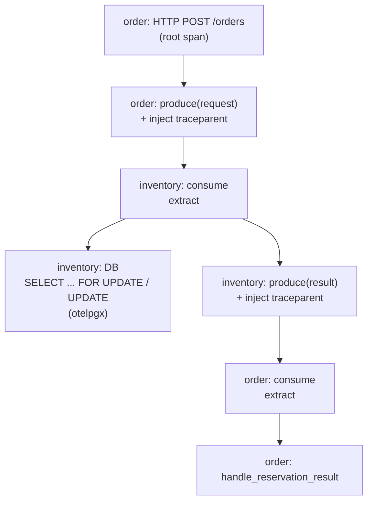

# 02. Sprint 2 Architecture — OpenTelemetry オブザーバビリティ

対象 PR: [enterprise-oss-lab/sample-ec-service#16](https://github.com/enterprise-oss-lab/sample-ec-service/pull/16)

## 概要

order (Python / FastAPI) と inventory (Go / Gin) の両バックエンドに **OpenTelemetry** を組み込み、
**トレース・メトリクス・ログ**の3シグナルを OTLP gRPC で `grafana/otel-lgtm` にエクスポートする。

最大の狙いは **saga をまたぐ1本の連続トレース**。注文処理は以下の choreography saga であり、
これを trace context 伝播で **単一 trace_id に連結**し、`POST /orders` から在庫 DB 更新・結果処理までを
Grafana Tempo 上で1本の trace ツリーとして可視化する。

```
order → Kafka(request) → inventory → Kafka(result) → order
```

## 使用するOSS

- OpenTelemetry (SDK / instrumentation / OTLP exporter)
- Grafana LGTM スタック (`grafana/otel-lgtm`: OTel Collector + Tempo + Loki + Prometheus + Grafana)
- k6 (負荷生成)
- Kafka / PostgreSQL (Sprint 0 から継続)

## 対象コンポーネント

| コンポーネント | 言語 / スタック | 計装 |
|----------------|-----------------|------|
| inventory | Go / Gin・pgx v5・confluent-kafka-go | 対象 |
| order | Python / FastAPI・asyncpg・confluent-kafka | 対象 |
| storefront | React / Vite | **対象外** |

storefront (ブラウザ) は計装しない。したがって order の HTTP サーバ span が trace の root になる。CORS 設定も変更しない。

## アーキテクチャ



- 収集基盤は `grafana/otel-lgtm:0.30.0` 単一コンテナ。データは**揮発** (ボリューム無し)。
- 全サービスは **OTLP gRPC (`:4317`)** で `otel-lgtm` にエクスポートする。
- Grafana を host `:3000` に公開して閲覧する。
- サンプリングは always-on (100%)、ラボ用途のため。

## 設計方針 (確定事項)

| # | 項目 | 決定 |
|---|------|------|
| 1 | シグナル | トレース + メトリクス + ログ (ログは trace_id 相関) |
| 2 | 収集/可視化基盤 | `grafana/otel-lgtm` 単一コンテナ、**データは揮発** |
| 3 | 計装範囲 | バックエンドのみ (storefront・CORS は不変) |
| 4 | order の計装スタイル | プログラマティック SDK 初期化 (ゼロコードエージェントは使わない) |
| 5 | Kafka 伝播 | **両サービスとも完全手動で対称** (`extract → span → inject`)。自動 Instrumentor は使わない |
| 6 | 非同期 saga のモデル | **親子 (parent-child) 伝播** (Tempo 上で1本のツリー) |
| 7 | Go のログ | slog へ**全面移行**、ホットパスは `...Context(ctx, ...)` |
| 8 | メトリクス | 自動 + **カスタム2種** (予約成功/失敗・注文ステータス遷移) |
| 9 | OTLP プロトコル | **gRPC (:4317)** |
| 10 | サンプリング | always-on (100%) |

### 補足: 主要な設計判断の根拠

- **Kafka を完全手動にした理由**: order の consumer は
  `await loop.run_in_executor(None, self._consumer.poll, 0.1)` で poll を別スレッドで回し、
  `_process` はイベントループ側スレッドで実行する。confluent-kafka の自動 consumer 計装は
  「poll が返した span を current context に載せ次の poll まで保持」する方式のため、span が
  executor スレッド側に載り、ループ側の `_process` が consume span の下にネストしない。この構造的
  ミスマッチを避けるため両サービスとも手動伝播に統一する (Go と同じ `extract → span → inject` の
  メンタルモデルに揃い、教材価値も高い)。
- **親子伝播にした理由**: saga は 1 request → 1 result の 1:1 であり fan-in が無い。親 span
  (HTTP / producer) が先に終了しても Tempo は同一 trace_id を1本に束ねるため、ツリー状に一望でき
  デモとして分かりやすい (span links の厳密性は過剰)。

## トレース連結 (受入基準)

`POST /orders` の HTTP span を root として、以下が**同一 trace_id** で Tempo 上に1本の trace ツリーとして表示されること。header key は両側とも W3C `traceparent` で互換。



## 共通の環境変数規約

`compose.yaml` で両サービスに付与する (標準 `OTEL_*`)。

| 変数 | 値 |
|------|-----|
| `OTEL_EXPORTER_OTLP_ENDPOINT` | `http://otel-lgtm:4317` |
| `OTEL_EXPORTER_OTLP_PROTOCOL` | `grpc` |
| `OTEL_SERVICE_NAME` | `inventory` / `order` |
| `OTEL_RESOURCE_ATTRIBUTES` | `service.namespace=sample-ec,deployment.environment=local` |

SDK は endpoint スキーム `http://` を insecure として解釈するため TLS 設定は不要。

## サービス別 計装仕様

### order (Python / FastAPI)

- **SDK 初期化** (`internal/telemetry/otel.py`): `Resource` (env 検出) で
  `TracerProvider` / `MeterProvider` / `LoggerProvider` を構築。OTLP gRPC exporter を
  `BatchSpanProcessor` / `PeriodicExportingMetricReader` / `BatchLogRecordProcessor` で接続。
  グローバル propagator を W3C TraceContext に明示設定し、`setup_telemetry()` を公開。
- **自動計装**: `FastAPIInstrumentor.instrument_app(app)`、`AsyncPGInstrumentor().instrument()`、
  `LoggingInstrumentor(set_logging_format=True)` で trace_id / span_id をログに注入し、
  ルートロガーに OTel `LoggingHandler` を追加して Loki へエクスポート。
- **Kafka 手動伝播**: producer は publish 時に span を開始し `propagate.inject` の dict を
  `headers=[(k, v.encode()), ...]` で送信。consumer は `_process` 内で `msg.headers()` を
  dict 化 → `propagate.extract` → 抽出 context を親に consumer span を開始し
  `handle_reservation_result` を実行 (span はループ側スレッドで張り、親子ネストを確実にする)。
- **カスタムメトリクス**: 注文ステータス遷移カウンタ
  `order.status.transitions{status=PENDING|CONFIRMED|FAILED|CANCELLED}`。

### inventory (Go / Gin)

- **SDK 初期化** (`internal/telemetry/telemetry.go`): `Setup(ctx)` で `resource` (env 検出) から
  `TracerProvider` / `MeterProvider` (otlpmetricgrpc + periodic reader) / `LoggerProvider`
  (otlploggrpc) を構築しグローバル登録。`otel.SetTextMapPropagator(propagation.TraceContext{})`。
- **自動計装**: `otelgin.Middleware("inventory")` (CORS の前に追加)、pgxpool に
  `otelpgx.NewTracer()`、`runtime.Start(...)` で Go ランタイムメトリクス。
- **ログ全面移行**: `otelslog` で `*slog.Logger` を生成し、全 `log.Printf` / `Fatalf` /
  `Println` を slog へ置換。span 内は `slog.InfoContext(ctx, ...)` で trace 相関。
- **Kafka 手動伝播**: `KafkaHeaderCarrier` (`[]kafka.Header` を `TextMapCarrier` として実装)。
  producer は span を開始し `Inject` で traceparent を注入、consumer は `Extract` → 親 context で
  span を開始しその ctx を `usecase.Reserve` と後続の `producer.Publish` に伝播。
- **カスタムメトリクス**: 予約成功/失敗カウンタ `inventory.reservations{result=success|failure}`。

## Grafana ダッシュボード (provisioning)

起動時に Grafana へ自動投入する **EC Overview** ダッシュボードを同梱する。

- `observability/grafana/dashboards/ec-overview.json` — 本体 (uid `ec-overview`)
- `observability/grafana/provisioning/dashboards/custom.yaml` — file プロバイダ定義
- compose の `otel-lgtm` に read-only でマウント。datasource UID は otel-lgtm 固定値
  (`prometheus` / `loki` / `tempo`) を参照。

CUJ ベースの SLI/SLO を最上段に配置 (閲覧の可用性・レイテンシ、注文作成の可用性・レイテンシ、
注文確定のビジネス成功率)、下段に saga 遷移レート・HTTP メトリクス・Go ランタイム・DB・Loki ログ。

### 指標名・semconv の注意

- OTel → Prometheus 変換でドットは `_`、カウンタには `_total`、単位が名前に付く
  (例: `http.server.duration` ms → `http_server_duration_milliseconds_*`)。
- **HTTP メトリクスは2サービスで semconv が異なる**ため横断クエリは書き分けが必要:
  - **order (FastAPI 計装)**: 旧 semconv の**ミリ秒**ヒストグラム `http_server_duration_milliseconds_*`。
    ラベルは `http_status_code` / `http_method` / `http_target` (実パス)。
  - **inventory (otelgin 計装)**: 新 semconv の**秒**ヒストグラム `http_server_request_duration_seconds_*`。
    ラベルは `http_response_status_code` / `http_request_method` / `http_route` (テンプレート化済み)。
- 「注文確定 ビジネス成功率」「在庫予約 成功率」は在庫不足 (ビジネス起因の拒否) を失敗として
  数える**ビジネス指標**であり、純粋な信頼性 SLI ではない。システム信頼性は HTTP 非5xx 可用性で判断する。

## 負荷生成と性能修正 (PR 追記)

ダッシュボードをリアルに動かすため、EC 的トラフィック (閲覧多め・購入少なめ) を継続生成する
`k6/ec-traffic.js` を追加。3 シナリオ **browse / purchase / restock**、purchase は
~80% 正常 / ~12% 在庫超過 (→ saga で `failed`) / ~8% 不正 body (→ 422)。意図的な 4xx は
per-request `responseCallback` で `http_req_failed` から除外。

この負荷で **order の POST/GET レイテンシが ~10s に張り付く** 事象を確認し (inventory は健全)、
order サービス側で4点修正した。

| 症状 | 原因 | 修正 |
|---|---|---|
| POST /orders が ~10s | Kafka `producer.flush(timeout=5)` を asyncio ループ上で同期実行しループ全体を停止 | 非ブロッキング `produce()` + `poll(0)`、常駐 poll ループ、flush は `close()` のみ |
| `cannot confirm order in status CANCELLED` の ERROR 大量 | キャンセル済み注文へ予約結果が遅延到着するレース | `handle_reservation_result` を冪等化し非 PENDING は INFO でスキップ |
| 負荷継続で再度 ~10-40s へ | `list_all` の N+1 + LIMIT 無し全件返却 | items を `ANY($1::uuid[])` で一括取得、`limit` (既定100) を repo/usecase/HTTP に貫通 |
| pgx acquire / goroutine スパイク | プール上限未設定 | asyncpg `max_size=20`、pgxpool `MaxConns=25/MinConns=5` |

**検証** (持続負荷 browse 20/s + purchase 10/s、注文 8k 件超): POST /orders `10000ms → ~6ms`、
GET /orders `44s → ~7ms`、`cannot confirm CANCELLED` エラー `→ 0`、k6 ピーク VU `200 → 40`。

## スコープ外

- storefront (ブラウザ) 計装 / CORS 変更
- 本番向けの認証・サンプリング戦略・永続ストレージ・アラート定義 (ラボ用途のため既定のまま)
- CI ワークフローの変更 / health・readiness エンドポイント

## 参考

- PR: https://github.com/enterprise-oss-lab/sample-ec-service/pull/16
- 設計仕様: `docs/observability.md` (sample-ec-service リポジトリ)
- OpenTelemetry: https://opentelemetry.io/docs/
- Grafana otel-lgtm: https://github.com/grafana/docker-otel-lgtm
