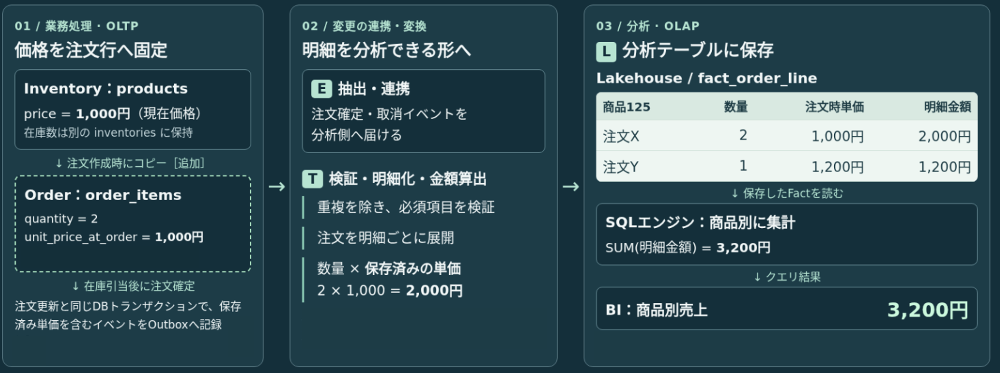
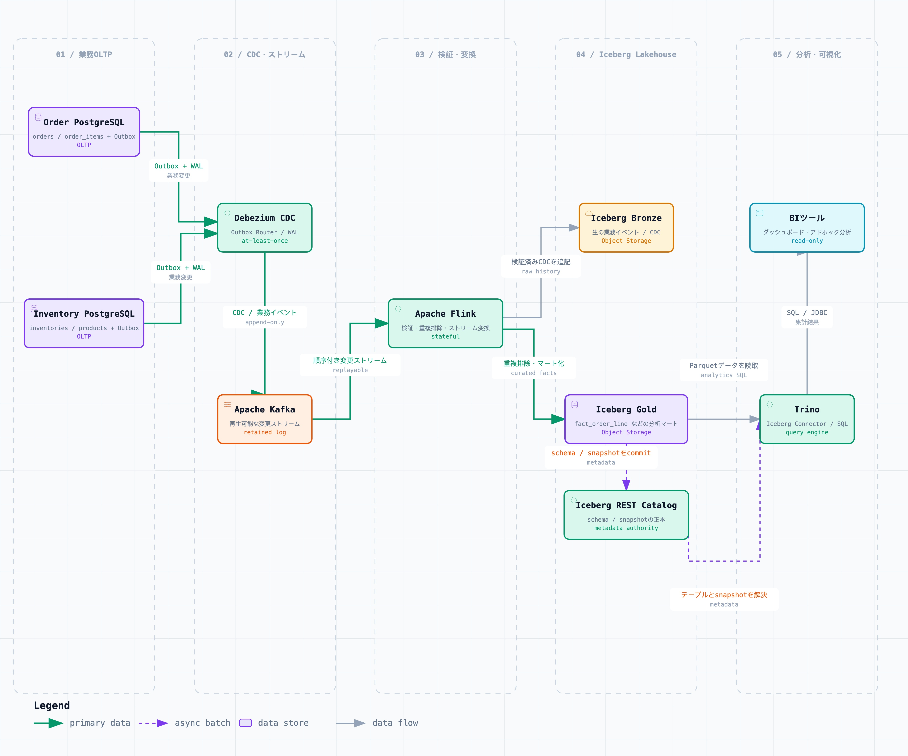
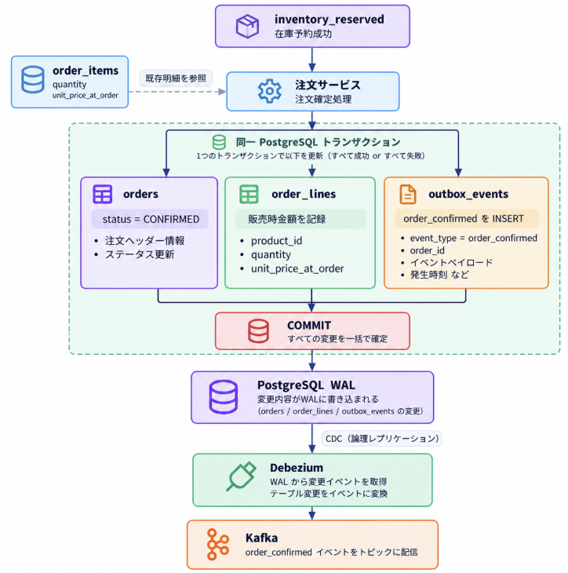

# 03. データ分析基盤構築

## TL;DR

- 自前のECサービスにデータ分析基盤を追加する
- そこではトランザクション処理と分析を同じPostgreSQLで行わず、OLTPとOLAPを分離して業務DBを重い集計から守る
- OSSで組み立てることで、SnowflakeやDatabricksなどのデータ基盤が担う機能と運用を理解する

## 概要

現在、自前のECサイトを作りながら、さまざまなサービスを試しています。今回のテーマは**データ分析基盤**です。SnowflakeやDatabricksは何を担う製品なのかを、似たような機能をOSSで一から組み立てることで学びます。

ECサイトを運用していると、次のような問いにすぐ答えたくなります。

- 今日の確定売上はいくらか
- 売れている商品・カテゴリは何か
- 在庫切れで販売機会を失っていないか

小さなサービスなら業務DBにSQLを実行しても答えられるかと思います。しかし、購入処理と同じPostgreSQLに重い集計を実行する構成は、データ量・利用者・クエリの数や頻度が増えると苦しくなってきます。

この記事では、注文・在庫サービスを持つサンプルECを題材に、OLTPと分析を分離し、OSSでほぼリアルタイムな分析基盤を作る設計を考えます。こちらでは、注文確定イベントがIcebergへ反映され、Trinoから検索できるまでの流れを確認します。

## 業務DBをそのまま分析に使うと何が困るのか

業務DB（OLTP：**O**n**L**ine **T**ransaction **P**rocessing）は、購入、在庫引当、注文状態更新のような短いトランザクションを確実に処理するためのものです。一方で分析（OLAP：**O**n**L**ine **A**nalytical **P**rocessing）は、大量の履歴を読み、結合・集約・ソートして傾向を調べます。

同じDBで両方を実行すると、重い分析クエリがCPU、メモリ、I/Oを使い、購入処理のレイテンシーに影響します。サービスが分かれている場合は、注文DBと在庫DBをまたぐ結合や、変更履歴の保持も必要になります。

そこで、業務DBは業務処理に専念させ、分析用の履歴データを別の場所へ継続的に蓄積します。

図にすると以下のような形になります。



[https://www.ibm.com/jp-ja/think/topics/olap-vs-oltp](https://www.ibm.com/jp-ja/think/topics/olap-vs-oltp)

[https://youtu.be/yRerKDM1h74?si=\_jjsTGJ42kJ4lAYY](https://youtu.be/yRerKDM1h74?si=_jjsTGJ42kJ4lAYY)

[https://youtube.com/shorts/0qlRQRYNAkk?si=NAdNNLJ1sK4M89BV](https://youtube.com/shorts/0qlRQRYNAkk?si=NAdNNLJ1sK4M89BV)

## 何を分析するか

業務DBのデータをそのまま別の場所へコピーすれば、分析できるわけではありません。分析基盤には、後から集計したい数字を再現できる形で、業務上の事実を蓄積する必要があります。何を事実として残すかを決めるには、まず「売上」などの指標が何を意味するのかを明確にします。

### 「売上」の定義

分析基盤の話を始める前に、数字の意味を決める必要があります。たとえば「売上」は次のように曖昧です。

- 注文作成時点と確定時点のどちらを計上するか
- 取消・返品をどう反映するか
- 税込・税抜のどちらを使うか
- 商品価格やカテゴリが変わった後、過去の売上をどの属性で見るか

本サービスでは次のように定義します。


| 利用者     | 主な指標              | 定義                                                                          |
| ------- | ----------------- | --------------------------------------------------------------------------- |
| 経営      | 確定売上              | `CONFIRMED`になった注文の`order_items`について、`quantity × unit_price_at_order`を合計した金額 |
| マーケティング | 商品別・カテゴリ別確定売上、販売数 | 同じ確定売上を商品・カテゴリ・期間で切り分ける                                                     |
| 在庫担当    | 在庫可用性             | 販売対象SKU×監視時間のうち、在庫数が0だった時間の割合                                               |


同じ「確定売上」を担当者ごとに別の式で計算するのではなく、定義は共通化し、見る切り口だけを変えることが重要です。

## どう分析するか

### Data Lake、Data Warehouse、Lakehouseという考え方

業務DBから分析処理を分離した後、そのデータをどこに、どのような形で蓄積するかを考える必要があります。現在の代表的な考え方が、Data Lake、Data Warehouse（DWH）、Lakehouseです。

以下それぞれの違いを以下記事より抜粋させていただいております。

[https://qiita.com/sigmalist/items/701a90310a14f98f6f56](https://qiita.com/sigmalist/items/701a90310a14f98f6f56)

| **項目**       | **データレイク**                                                              | **データウェアハウス（DWH）**                                    | **データレイクハウス**                               |
| :------------ | :----------------------------------------------------------------------- | :----------------------------------------------------- | :------------------------------------------- |
| 概要           | データをファイルのまま蓄積し任意の並列分散処理エンジンで分析                                          | テーブルデータをSQLで高速分析する専用DB                                | データレイク上でDWHに近い性能とトランザクションを実現                |
| 対応データ形式      | 構造化/非構造化データ                                                             | 構造化データ（表形式）                                           | 構造化/非構造化データ                                 |
| ACIDトランザクション | 非対応                                                                     | 対応                                                    | 対応                                          |
| 参照性能         | 中                                                                       | 高                                                     | 高                                           |
| 更新性能         | 低                                                                       | 中                                                     | 中                                           |
| コスト          | 低コストのストレージ                                                              | 高コストの専用DB                                             | 低コストのストレージ                                  |
| 主要製品         | Hadoop (HDFS), Amazon S3, Azure Data Lake Storage, Google Cloud Storage | Teradata, Amazon Redshift, Google BigQuery, Snowflake | **Apache Iceberg**, Apache Hudi, Delta Lake |


> データウェアハウスを利用する場合は、生データ（非構造データ）を一旦データレイクに蓄積して、前処理（加工・欠損値補完など）を行い整形してから、データウェアハウスに格納してSQLで分析する **モダンデータレイク・アーキテクチャ** が一般的です。
>
> しかし、扱うデータの多様化・大規模化に伴い、データレイク上のデータに対して直接SQLを実行する **データレイクハウス・アーキテクチャ** への移行が進んでいます。これは、高速なSQLとトランザクションをデータレイク上で実現することで、運用・管理コストを削減するアプローチです。
>
> Lakehouseは、Data Lake とData Warehouse の両方の利点を持ちます。

今回は、運用・管理コストを加味して、オープンなインターフェースを通じて組み合わせられる構成を目指します。データはObject Storageへ保存し、Icebergによってテーブルとして管理します。ストリーミング処理はFlink、SQLエンジンはTrinoを利用します。

## アーキテクチャ

OrderサービスとInventoryサービスのDBから変更をストリームへ流し、Flinkで検証・変換して、Icebergテーブルに保存します。分析側はTrinoからIcebergを読み、SQLで集計します。



各コンポーネントの役割は次の通りです。


| コンポーネント                  | 役割                                       |
| ------------------------ | ---------------------------------------- |
| PostgreSQL               | 注文・在庫のトランザクションとOutboxを保持する               |
| Debezium                 | PostgreSQLのWALを読み、Outboxの変更をKafkaへ転送する   |
| Kafka                    | 変更イベントを保持し、再処理可能なストリームとして配信する            |
| Flink                    | イベントを検証・重複排除・変換し、Icebergへ書き込む            |
| Object Storage + Iceberg | 履歴データと分析マートを、スキーマやsnapshotを持つテーブルとして管理する |
| Iceberg REST Catalog     | FlinkとTrinoが共有するテーブルメタデータの正本になる          |
| Trino                    | Iceberg上のデータをSQLで集計する                    |
| BIツール                    | Trinoの集計結果をダッシュボードなどで可視化する (技術選定中)       |


個々の技術は、オープンなインターフェースやデータ形式を中心に選んでいます。ここからは、注文確定という業務上の事実が、どのように分析可能なデータになるかを順に見ていきます。

### 注文確定イベントをKafkaへ届ける

このECサービスでは、注文サービスと在庫サービスのSaga連携にもKafkaを使います。ただし、Sagaで流れる在庫予約要求や予約結果は、サービス間の処理を進めるための途中経過です。予約後に注文が取り消される可能性があり、注文確定という業務上の事実を表すものではないため、そのまま確定売上には使えません。

注文作成時には、既存の`order_items`へ数量と`unit_price_at_order`を保存し、注文時点の単価を固定しています。そこで在庫予約が成功し、注文サービスが注文を確定する時点で、保存済みの注文明細から分析イベント`order_confirmed`を作ります。データは以下の図の順序で流れます。





| 順序  | 実行するもの            | 処理とデータ                                                            |
| --- | ----------------- | ----------------------------------------------------------------- |
| 1   | 注文サービス            | Sagaの`inventory_reserved`を受け取り、注文を確定できると判断する                      |
| 2   | 注文サービス＋PostgreSQL | 既存の`order_items`から数量と注文時単価を読み、同じDBトランザクションで注文更新とOutboxへのイベント追加を行う |
| 3   | PostgreSQL        | `COMMIT`した変更をWALへ記録する                                             |
| 4   | Debezium          | WALからOutboxへの追加を検出する                                              |
| 5   | Debezium＋Kafka    | `order_confirmed`をKafkaへ転送する                                      |


↓ Outboxへ記録する中身

```json
{
  "event_id": "event-001",
  "event_type": "order_confirmed",
  "occurred_at": "2026-10-09T10:00:00+09:00",
  "order_id": "order-100",
  "items": [
    {
      "order_item_id": 1,
      "inventory_id": 10,
      "quantity": 2,
      "unit_price_at_order": 1000,
      "net_amount": 2000
    }
  ]
}
```

### WAL とDebezium

**WAL（Write-Ahead Logging）** とは、

> **データ本体を変更する前に、必ずログ（変更履歴）を先に書き込む**

というデータベースの基本ルールです。（[https://zenn.dev/waffledog/scraps/a2e67116ba8833](https://zenn.dev/waffledog/scraps/a2e67116ba8833)）

Debeziumは、WALから確定済みトランザクションの変更を取得し、行の追加・更新・削除を変更イベントとしてKafkaへ配信します。このように、データベースで発生した変更を継続的に取得する仕組みをCDC（Change Data Capture）と呼びます。

#### なぜKafkaへ直接送らないのか

注文サービスがDB更新とKafka送信を別々に行うと、途中で障害が起きた際に不整合が生じます。

```text
DBの注文確定は成功 → Kafka送信前に停止
→ 実際には売れたが、分析には届かない

Kafka送信は成功 → DBの確定処理はロールバック
→ 実際には売れていないが、分析には売上がある
```

Outbox patternでは、注文サービスはKafkaへ直接送信しません。次の三つを同じPostgreSQLトランザクションで行います。

1. `orders`を`CONFIRMED`に更新する
2. 既存の`order_items`から`quantity`と`unit_price_at_order`を読み、`order_confirmed`を組み立てる
3. `outbox_events`に`order_confirmed`を`INSERT`する

`orders`の更新と`outbox_events`への追加はまとめて`COMMIT`されるため、両方とも成功するか、両方とも失敗します。その後のKafkaへの転送は、PostgreSQLのWALを監視するDebeziumが担当します。

## Flinkで検証・重複排除・変換する

Kafkaへ届いたイベントを、そのままBIから利用するわけではありません。Flinkは継続的にイベントを読み、分析用データとして扱えるかを検証してIcebergへ書き込みます。

PoCでFlinkが担う処理は次の通りです。

1. `event_type`、`event_id`、`occurred_at`などの必須項目を検証する
2. `event_id`を使い、再送されたイベントを重複して処理しない
3. 受信した`order_confirmed`をBronzeテーブルへ保存する
4. `items`を注文明細単位に展開する
5. `unit_price_at_order`、数量、売上額、確定日時を`fact_order_line`へ変換する
6. Goldテーブルへ書き込む

```text
order_confirmed 1件
  ├─ 注文明細1件目 → fact_order_line 1行
  └─ 注文明細2件目 → fact_order_line 1行
```

Bronzeには受信したイベントを再処理できる形で残し、Goldには利用者が売上を集計しやすい形で保存します。変換ロジックを変更した場合も、BronzeからGoldを作り直せるようにします。

#### メダリオンアーキテクチャ

メダリオンアーキテクチャとは、レイクハウスのデータを論理的に整理するために用いられるデータ設計を意味します。「生データ（Raw）」「クレンジング済み（Validated）」「集計・分析用（Enriched/Mart）」というように、データを3つの階層に分けて段階的に処理していきます。

このアーキテクチャは、データの品質と構造を段階的に向上させるよう設計されており、各レイヤーを通じてデータの管理と分析の効率を最大化します。また、データの履歴管理と再処理が容易です。

[https://www.databricks.com/jp/blog/what-is-medallion-architecture](https://www.databricks.com/jp/blog/what-is-medallion-architecture)

## Icebergを分析用の共通データ層にする

Apache Icebergは、Object Storage上のデータをDBのテーブルのように扱うためのオープンなテーブル形式です。Flinkで書き込み、Trinoで読むというように、ストレージと計算エンジンを分離できます。

ここでは、用途の異なるテーブルを二層に分けます。


| 層      | 役割                                                 |
| ------ | -------------------------------------------------- |
| Bronze | Kafkaから届く`order_confirmed`をほぼそのまま保存する。再処理の出発点にする   |
| Gold   | BIが直接読む`fact_order_line`を持つ。商品別・日別売上をすぐに集計できるようにする |


Icebergはデータファイルだけでなく、snapshotやスキーマを管理します。Flinkのチェックポイントが正常に完了すると、Icebergへの書き込みが新しいsnapshotとしてコミットされ、Trinoは確定済みのsnapshotを参照します。これにより、Trinoが書き込み途中のファイルを読み、結果が不完全になることを避けられます。

FlinkとTrinoが同じテーブルを安全に共有するには、REST Catalogの実装を一つ選び、テーブル名とメタデータの所在を管理する正本にします。この構成では、データを特定のクエリエンジン内部へ閉じ込めず、Icebergテーブルを中心に書き込み側と読み取り側を分離できます。

## TrinoからGoldテーブルを問い合わせる

TrinoはIceberg Catalogを通じてGoldテーブルを参照し、Object Storage上の必要なデータファイルを読み取ります。利用者は保存先のファイルを意識せず、通常のテーブルと同じようにSQLで問い合わせられます。

たとえば、商品別・日別の確定売上は次のように集計します。

```sql
SELECT
    CAST(confirmed_at AS DATE) AS sales_date,
    inventory_id,
    SUM(quantity) AS quantity,
    SUM(net_amount) AS net_amount
FROM fact_order_line
GROUP BY 1, 2
ORDER BY 1, 2;
```

ここでTrinoが読むのは、Flinkが作成したGoldテーブルです。OrderサービスやInventoryサービスの業務DBへ分析クエリを実行しないため、重い集計が購入処理とCPU、メモリ、I/Oを奪い合うことを避けられます。

## OSSで組み立てて分かること

この構成では、取り込み、ストリーム処理、ストレージ、テーブル管理、SQL実行、可視化を別々に選び、接続・監視・更新する必要があります。Snowflake、Databricks、watsonx.dataなどのデータ基盤製品は対象範囲こそ異なりますが、こうした機能の多くを統合されたサービスや運用機能として提供します。

OSSで一度組み立てることで、マネージド製品を比較するときにも、単なる機能一覧ではなく、カタログ、権限管理、データ品質、性能最適化、監視といった運用負荷まで含めて判断できるようになります。

## 進め方

### Phase 1: 商品別確定売上

Outbox → Debezium → Kafka → Flink → Iceberg → Trinoを使用して商品別確定売上を取れるようにします。

確認項目は次の通りです。

- 注文確定から5分以内を目安に、`fact_order_line`をTrinoから検索できる
- 商品別・日別の確定売上をTrinoで集計できる
- Debezium・Kafkaの再送があっても二重計上しない
- 分析クエリがOrder・Inventoryの業務DBへ直接負荷をかけない

### Phase 2: 在庫可用性

Inventoryの在庫変更履歴を取り込み、SKUごとの在庫ゼロ開始・終了時刻を算出します。これにより、`在庫ゼロ時間 / 販売対象時間`を在庫可用性として可視化できます。

### Phase 3: BI

GoldテーブルをApache SupersetなどのBIへ接続し、経営・マーケティング・在庫担当向けにダッシュボードを提供します。

### Phase 4 以降 : 運用

同時に、データ品質、スキーマ変更、snapshot期限、small file compaction、アクセス権、監査ログを運用に組み込みます。

## まとめ

## 参考

- [Debezium: Outbox Event Router](https://debezium.io/documentation/reference/stable/transformations/outbox-event-router.html)
- [Debezium: PostgreSQL Connector](https://debezium.io/documentation/reference/stable/connectors/postgresql.html)
- [PostgreSQL: Write-Ahead Logging](https://www.postgresql.org/docs/current/wal-intro.html)
- [PostgreSQL: Logical Decoding](https://www.postgresql.org/docs/current/logicaldecoding.html)
- [Apache Iceberg: Flink Writes](https://iceberg.apache.org/docs/latest/flink-writes/)
- [Apache Iceberg: REST Catalog Specification](https://github.com/apache/iceberg/blob/main/open-api/rest-catalog-open-api.yaml)
- [Trino: Iceberg connector](https://trino.io/docs/current/connector/iceberg.html)
- [Trino: Resource groups](https://trino.io/docs/current/admin/resource-groups.html)
